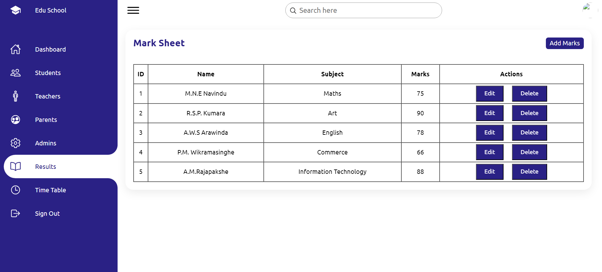
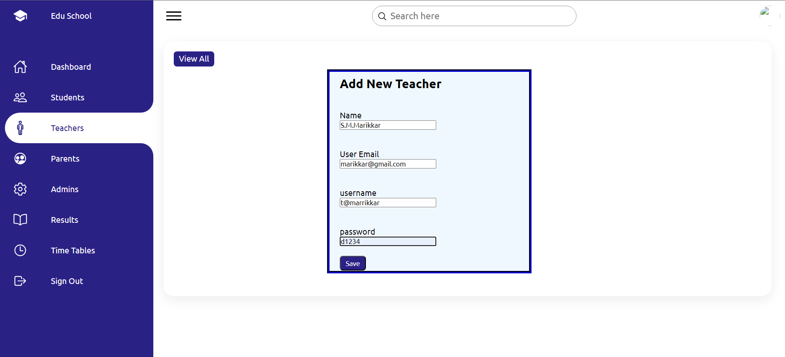
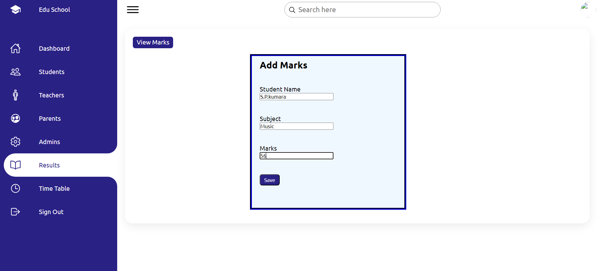

# Edu-School - Teachers Management System
### Member 1 - Rathnayake M.D.M
### Member 2 - Pabasara S.D
### Member 3 - V.G.Tharushi Lakshika
### Member 4 - Samarasinghe.V.R

####<h1> Brief Description of Project - </h1> 

This Project is to develop a Management System for Second Year First Semester OOP Project.
It provides School to manage teachers, Results and Time Tables. that may help in saving the energy and time that needed to do the studdy by handling Books or hard coppiess.
Teachers need to register before attending to System. After he/she can use the system.

####<h2> Technologies used - Java (jsp, servelet), MySQL, Tomcat </h2>

###<h2> Scrennshots --> </h2>
  

   

  

  

  
